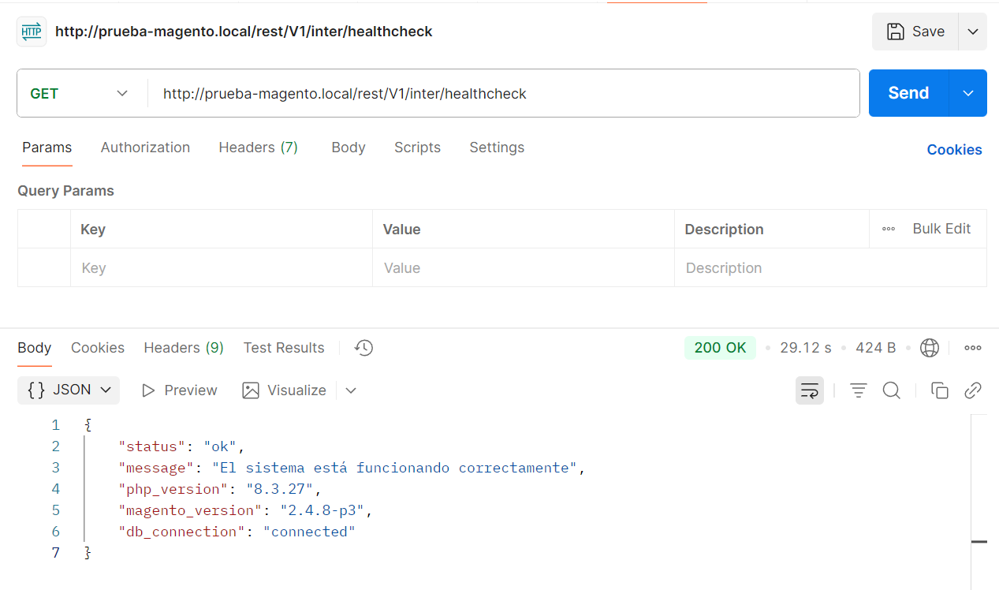
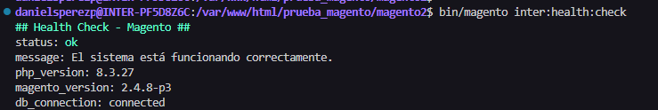
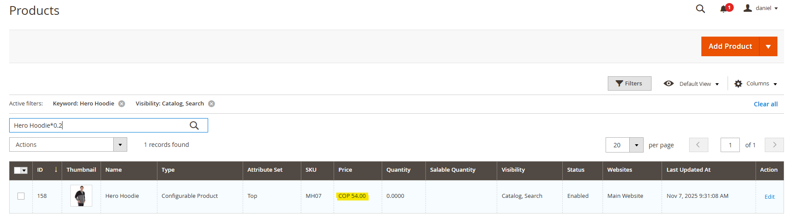
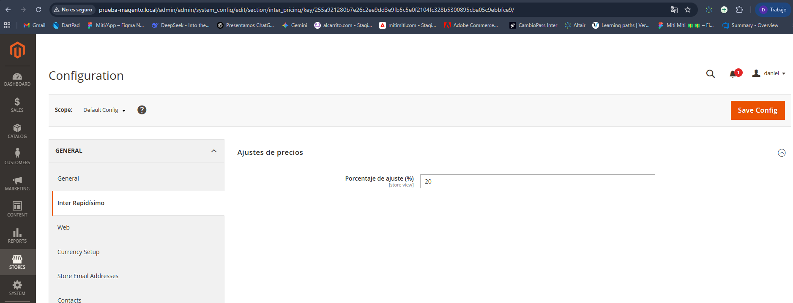

# Inter Modules - Prueba Técnica Ingeniero Master Magento

### 🧩 Módulos Incluidos
1. **Inter_HealthCheck**  
   - Endpoint REST: `GET /V1/inter/healthcheck`  
   - Comando CLI: `bin/magento inter:health:check`

2. **Inter_PricingAdjust**  
   - Ajusta el precio de los productos según un porcentaje configurado en  
     `Stores > Configuration > Inter > Pricing Adjustments > Markup Percentage`

---

### ⚙️ Versión de Magento
Desarrollado y probado en **Magento 2.4.6-p3 (PHP 8.2)**

---

### 🚀 Instalación

1. Copiar los módulos en:

app/code/Inter/HealthCheck

app/code/Inter/PricingAdjust

2. Ejecutar:

```bash
bin/magento setup:upgrade
bin/magento setup:di:compile
bin/magento cache:flush

GET {base_url}/rest/V1/inter/healthcheck
bin/magento inter:health:check
```


### 🖼️ Evidencias

### Modulo Health Check

Endpoint funcionando:



CLI funcionando:




### Modulo Pricing Adjust

Precio de Producto Original:



Configuración de Ajuste de Precios (%):



Precio Final con Ajuste:


Desarrollado por Daniel Pérez
Prueba técnica - Ingeniero Master Magento

